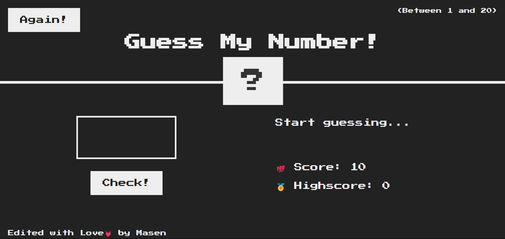

<h1 align="center">Guess My Number Game 🔢<h1>

### This game has been written with HTML, CSS and Javascript. 
### Main project by "Jonas Schmedtmann" from "Udemy". 
### Run the program with live-server on `index.html`
### See demo on [This URL](https://devmasen.github.io/guess-my-number-game/)
#### How to play : 
> Enter a number and click on 'check' button and repeat untill reach the correct answer and win.

> If you reach the answer in less number of clicks, you will get a higher score.

> The highest score will save in each round.

> If the score reach zero you will lose the game.
